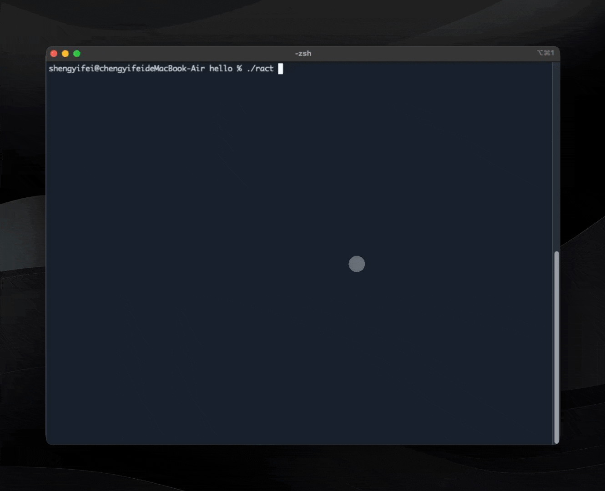

<div align="center">
  <h1>Ract</h1>

   
  
  <div>
    
  </div>
</div>

**Ract** is a conversational CLI tool written in Rust, designed to simplify the development process by providing an all-in-one solution for:  

- Integrating dependencies  
- Setting up environments  
- Generating project templates  
- Running and packaging projects  

With **minimal arguments** and an **intuitive dialog-based interface**, Ract supports frameworks like **GenUI** and **Makepad**, making your development workflow smooth and efficient. 🚀

> [!IMPORTANT]
> **Please make sure Ract is the latest version！**

---

## 🛠️ Config | Install

### Cargo

```shell
cargo install ract
```

### Self Install

> [!WARNING]
> Your computer may prompt security questions, please select Allow

You can configure ract as a global command in the following way：

#### Macos | Linux

```shell
# copy download ract to /usr/local/bin
sudo cp /path/to/download/ract /usr/local/bin/ract/ract

# add permission
sudo chmod 755 /usr/local/bin/ract
sudo chmod 755 /usr/local/bin/ract/ract

# confirm permission
sudo chown -R $(whoami) /usr/local/bin/ract

# echo to .zshrc
echo 'export PATH="/usr/local/bin/ract:$PATH"' >> ~/.zshrc

source ~/.zshrc
# get version
ract --version
```

#### Windows

put `path/to/ract` into System Env

---

## 📖 Document for Ract

You can choose the following documents for usage

- If you are a GenUI developer
  - [Ract for GenUI](./README/gen_ui.md)
  - [GenUI Book (Tutorial for Ract)](https://privoce.github.io/GenUI.github.io/tools/ract/introduction)
- [Ract for Makepad](./README/makepad.md): If you are a Makepad developer

> [!TIP]
>
> Even though they are only slightly different, you still need to treat them differently.

---

## 🎯 Features  

### Core Features  

- **Initialization**: Automatically generate `.env` and environment templates.  
- **Toolchain Check**: Verify if all dependencies are installed.  
- **Interactive Installation**: Install only the tools you need.  
- **Environment Configuration**: Flexible configuration of environment paths.  
- **Project Running**: Run Makepad or GenUI projects with a single command.  
- **WASM Support**: Build and serve WASM projects in the browser.  
- **Project Packaging**: Streamlined packaging for distribution.  
- **Watcher**: Monitor changes for automatic reload.  
- **Logger**: Advanced logging system for debugging.  
- **Uninstall**: Clear resources when use `ract uninstall`.
- **Auto Update**: Automatic updates to new versions.
- **Better Terminal UI**: Use ratatui to optimize terminal ui.
- **Documentation**: Include a comprehensive book for learning Makepad and GenUI. 
- 
### Future Features  
 
- **Cross-platform Packaging**: Simplify builds for multiple platforms.  
- **Remote Services**: Enable Ract to call some remote services.

---

## 🕒 CHANGELOG

see [CHANGELOG](./CHANGELOG.md)

---

Ract makes your Rust-based development with **Makepad** and **GenUI** easier, faster, and more efficient. 🎉  

Feel free to contribute or share feedback to help us improve! 😊 